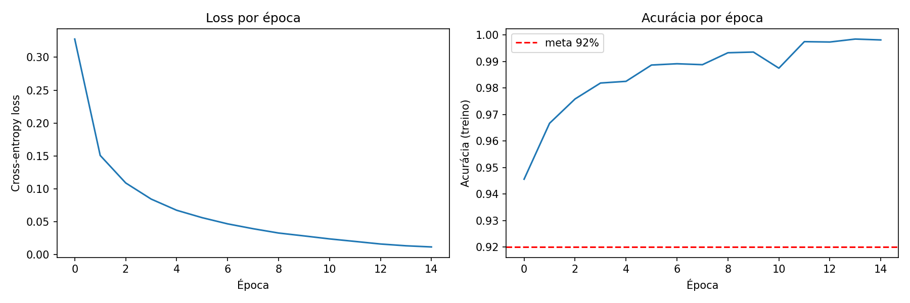
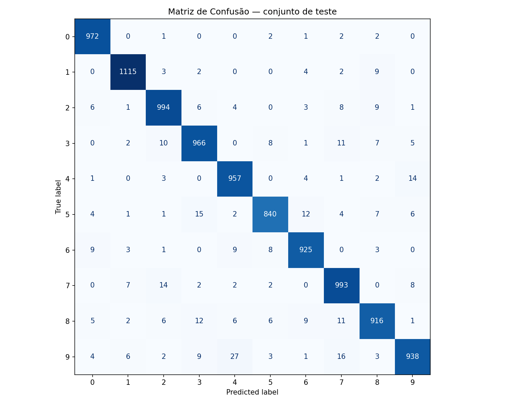
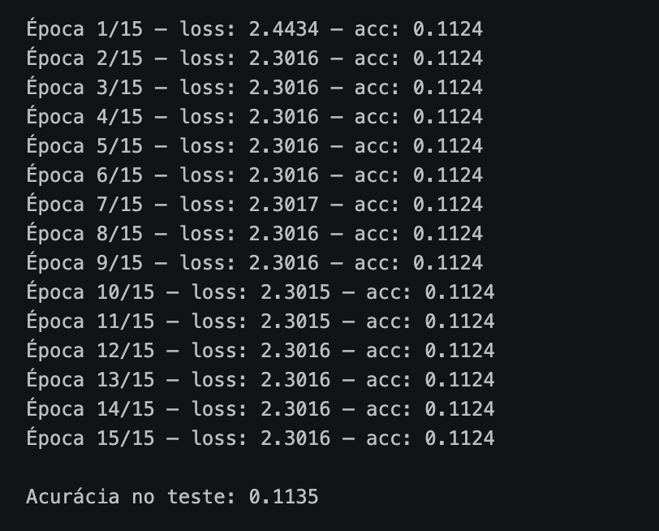
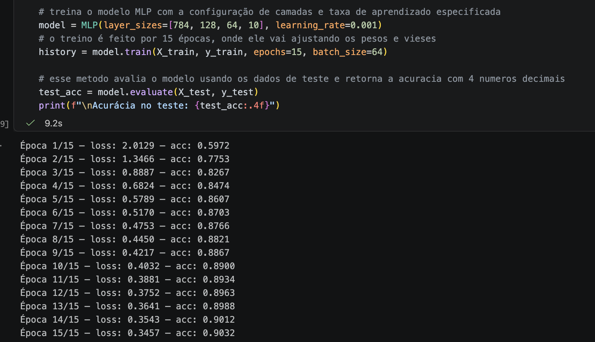

# MLP do Zero — Classificação MNIST

Implementação de um Multi-Layer Perceptron (MLP) do zero, usando apenas NumPy. Treinado no dataset MNIST com acurácia de **97.89% no conjunto de teste**.

---

## Como rodar

```bash
# instalar dependências
pip install -r requirements.txt

# rodar o notebook
jupyter notebook notebooks/experimentos.ipynb
```

> O notebook carrega o MNIST via `tensorflow.keras.datasets` (apenas para o download dos dados), treina o modelo e salva os plots em `results/`.

---

## Estrutura do repositório

```
.
├── README.md
├── mlp/
│   ├── __init__.py
│   ├── network.py        ← classe MLP com forward, backward e treino
│   ├── activations.py    ← ReLU, sua derivada e Softmax
│   ├── losses.py         ← cross-entropy loss e gradiente
│   └── optimizers.py     ← SGD
├── notebooks/
│   └── experimentos.ipynb
├── results/
│   ├── training_curves.png
│   ├── confusion_matrix.png
│   └── comparacao_configs.csv
└── requirements.txt
```

---

## Arquitetura escolhida

```
Entrada: 784 → Camada oculta 1: 128 → Camada oculta 2: 64 → Saída: 10
```

| Componente        | Escolha                   |
|-------------------|---------------------------|
| Camadas ocultas   | 2 (128 e 64 neurônios)    |
| Ativação oculta   | ReLU                      |
| Ativação de saída | Softmax                   |
| Loss              | Cross-entropy             |
| Otimizador        | SGD com mini-batches      |
| Learning rate     | 0.1                       |
| Batch size        | 64                        |
| Épocas            | 15                        |
| Inicialização     | He                        |

Foi escolhido a ReLU nas camadas ocultas porque ela não satura para valores positivos, o que evita o problema de vanishing gradients que ocorreria com sigmoid ou tanh em redes mais profundas. A inicialização He escala os pesos por sqrt(2 / fan_in), que mantém a variância das ativações estável entre camadas. Por isso ela é a inicialização recomendada especificamente para redes com ReLU.

O tamanho das camadas (128 → 64) foi escolhido principalmente porque é grande o suficiente para aprender representações do MNIST, mas não ao pornto de ser muito grande a ponto de causar overfitting ou um treinamento lento.

A inicialização He (np.random.randn(fan_in, fan_out) * np.sqrt(2.0 / fan_in)) é necessária especificamente por causa da ReLU. Se os pesos fossem inicializados com np.random.randn sem o fator de escala, muitos neurônios iriam receber valores negativos na primeira passagem, a ReLU zera eles, os gradientes ficam zerados no backward, e a rede para de aprender, o problema chamado de "dying ReLU". O fator sqrt(2 / fan_in) calibra a variância dos pesos para compensar o fato de que a ReLU descarta metade das ativações.

A saída usa Softmax combinada com cross-entropy loss. Matematicamente, o gradiente combinado das duas é simplesmente y_pred - y_true, o que simplifica bastante o backward pass da última camada, não é necessário calcular todas as mamtrizes completas do Softmax separadamente.

---

## Resultados

**Acurácia final: 97.89% no conjunto de teste** (60.000 imagens de treino, avaliado em 10.000 imagens nunca vistas durante o treinamento)

### Curvas de treinamento



O gráfico da esquerda mostra a cross-entropy de loss média por época no conjunto de treino. Ela começa em ~0.32 na primeira época e cai até mais ou menos 0.012 na época 15, uma redução de ~96%. A queda é mais acentuada nas primeiras épocas porque os gradientes são maiores quando os pesos ainda estão longe do mínimo, assim, conforme a rede melhora, os ajustes ficam cada vez menores.

O gráfico da direita mostra a acurácia no conjunto de treino ao longo das épocas. A rede ultrapassa a meta de 92% já na primeira época e termina em ~99.84%.

Houve também um pouco de diferença entre treino (~99.84%) e teste (~97.95%) indicando um pouco de overfitting leve mas aceitável, a rede generalizou bem para dados que não tinha visto.

### Matriz de confusão



Os erros mais frequentes foram:

| Real | Previsto | Ocorrências |
|------|----------|-------------|
| 9    | 4        | 27          |
| 9    | 7        | 16          |
| 5    | 3        | 15          |
| 4    | 9        | 14          |
| 7    | 2        | 14          |
| 5    | 6        | 12          |
| 8    | 3        | 12          |
| 3    | 7        | 11          |
| 8    | 7        | 11          |

Esses erros não são aleatórios, eles seguem uma lógica visual. O 9 por exemplo é confundido com o 7 (16 vezes), o que faz sentido porque ambos têm uma haste descendente longa. O 7 sendo confundido com 2 (14 vezes) também faz sentido, em algumas caligrafias o 7 tem uma curva no topo que o aproxima do 2. A rede parece errando nos mesmos lugares onde um humano também erraria.

### Comparação de configurações

| Config     | Arquitetura              | LR   | Acc Treino | Acc Teste | Loss Final |
|------------|--------------------------|------|------------|-----------|------------|
| baseline   | [784, 128, 64, 10]       | 0.1  | 99.81%     | 97.96%    | 0.0110     |
| rede maior | [784, 256, 128, 64, 10]  | 0.1  | 100.00%    | 98.12%    | 0.0015     |
| lr menor   | [784, 128, 64, 10]       | 0.01 | 96.75%     | 96.16%    | 0.1196     |

A rede maior conseguiu ~98.12% no teste mas memorizou completamente o treino (100% de acurácia, loss de 0.0015). O baseline tem uma relação melhor entre desempenho e generalização. O lr=0.01 converge, mas lentamente para 15 épocas, com mais tempo provavelmente alcançaria a mesma métrica.

---

## Decisões e dificuldades

### 1. Qual foi a decisão técnica mais difícil?

Acredito que a parte mais difícil foi implementar o backward pass corretamente, mais especificamente na aplicação da derivada da ReLU. A ReLU funciona de um forma onde, para cada neurônio, se o valor que entrou (Z) era positivo, ele passa, se era negativo ou zero, vira zero. Ou seja ela age como uma máscara, neurônios ligam onde Z > 0 e desligam onde Z ≤ 0. A derivada dela é essa máscara, 1.0 onde o neurônio estava ligado, 0.0 onde estava desligado.

No backward pass, quando o erro dA chega numa camada oculta, sabemos que do erro total, só a parte que passou por neurônios ativos realmente passou por cada neurônio. Então multiplica-se dA pela máscara elemento a elemento (*), e os neurônios que estavam desligados ficam com gradiente zero.

Eu errei quando usei produto matricial (@) em vez da multiplicação elementwise (*). Com @, cada elemento de dA vira uma combinação de vários elementos da máscara, o que não faz muito sentido. Não existe mistura entre neurônios diferentes nesse passo, cada neurônio tem sua própria chave de ligar/desligar. O resultado parecia certo à primeira vista porque as dimensões das matrizes estavam certos em alguns casos, mas os gradientes estavam errados e a loss não convergia.

Outro ponto que exigiu atenção foi a estabilidade numérica do Softmax. Na primeira versão, quando calculei o exp(z) diretamente, os valores meio que "explodiam" para inf quando os logits eram grandes, resultando em nan (not a number) na loss. A solução foi subtrair o máximo de cada linha antes de aplicar a exponencial, exp(z - max(z)). O resultado matemático é igual, porém numericamente estável.

Sobre os shapes do backpropagation:

No forward pass, cada camada calcula Z = A @ W + b. Se esta sendo processado um batch de 64 imagens e a camada vai de 128 para 64 neurônios, então A tem shape (64, 128) e W tem shape (128, 64), o resultado Z tem shape (64, 64).
No backward é necessário descobrir o gradiente de W, ou seja, o quanto cada peso contribuiu para o erro. A conta é dW = A_prev.T @ dZ. Transpor A_prev transforma (64, 128) em (128, 64), e multiplicar por dZ de shape (64, 64) resulta em (128, 64) — que é exatamente o shape de W. Isso faz sentido: para cada par (entrada, saída), acumulamos o quanto essa conexão contribuiu para o erro em cada exemplo do batch.

Para passar o erro para a camada anterior: dA = dZ @ W.T. Transpor W de (128, 64) para (64, 128), multiplicar por dZ de (64, 64), resulta em (64, 128) — o shape correto para a camada de trás processar. O perigo aqui é que as dimensões às vezes batem por acidente mesmo com a operação errada, então o código não dá erro mas os gradientes estão incorretos. Desenhar esses shapes antes de escrever o código evita esse tipo de bug silencioso.

### 2. O que tentei que não funcionou?

Pixels sem normalização: Eu eu tinha removido o /255.0 da conta X_train = X_train.reshape(-1, 784).astype(np.float32) / 255.0. A rede tinha travado, onde eu ficava com um loss de ~2.3040 nas 15 épocas com uma acurácia de ~11%, ou seja um chute aleatório em 10 classes. Depois de pesquisar descobri que o valor de 2.3040 não era coincedência, ele é exatamente ln(10), o valor esperado para uma distribuição uniforme sobre 10 classes. O problema era que os pixels em escala de 0-255 produziam ativações grandes nas primeiras camadas, fazendo os gradientes chegarem reduzidos nas camadas anteriores ao ponto dos pesos praticamente não se moverem. A normalizac1ão de [0,1] manteve as ativações em uma escala compatível com a inicialização He e o learning rate.

<div align="center">
  <sub>FIGURE 2 – epoca</sub><br>
    <br>
  <sup>Source: Material produced by the authors, 2025.</sup>
</div>

Learning rate baixo: Eu também tinha começado o meu treinamento com um learning rate baixo `lr=0.001`, onde a rede não conseguiu atingir 92% nas 15 épocas. Ou seja o modelo não conseguia aprender no tempo suficiente. A loss caía mas não em um ritmo suficiente, por isso ajustei para `lr=0.1`, assim o problema foi resolvido sem causar instabilidade nos gradientes.

<div align="center">
  <sub>FIGURE 2 – epoca</sub><br>
    <br>
  <sup>Source: Material produced by the authors, 2025.</sup>
</div>

### Sobre a reprodutibilidade

Eu fiz também com que o notebook rodado duas vezes pode dar resultados ligeiramente diferente, por exemplo 97.40% em uma rodada em 97.85% em outra. Isso acontece porque duas partes do código usam random não fixo. A inicialização dos pesos no mp.random.randn e o embaralhamento dos batches para cada época com o np.random.permutation. Para que os resultados ficassem iguais bastaria adicionar np.random.seed(42) no começo do jupyer notebook mas decidi não fixar, para que os experimentos pudessem refletir o comportamento real do modelo sob diferentes inicializações.

### 3. Se fosse refazer do zero, o que faria diferente?

Se eu fosse começar do zero eu iria começar pelo caso mais simples antes de ir direto para o MNIST, com a rede no XOR. Acredito que passei um tempo considerável tentando debugar o backward no contexto completo de 784 entradas e 60k amostras. Eu aprendi bastante concertando os erros, porém um teste simples poderia ter isolado o problema do gradiente mais rápido por exemplo.

Além disso eu implementaria o gradient check númerico no começo. Assim eu iria comparar com o gradiente analítico com a aproximação `(f(x+ε) - f(x-ε)) / 2ε` que estava no arquivo do colab da atividade. Ter essa verificação antes de rodar as 15 épocas teria sido interessante pois também teria economizado tempo na hora de tratar erros. Pesquisei que se a diferença fosse menor que ~1e-5, o gradiente estaria correto